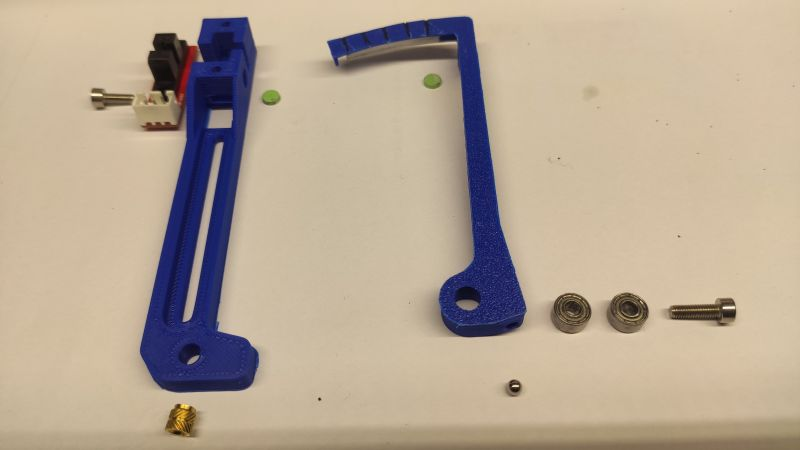

Shield: [![CC BY-NC-SA 4.0][cc-by-nc-sa-shield]][cc-by-nc-sa]

This work is licensed under a
[Creative Commons Attribution-NonCommercial-ShareAlike 4.0 International License][cc-by-nc-sa].

[![CC BY-NC-SA 4.0][cc-by-nc-sa-image]][cc-by-nc-sa]

[cc-by-nc-sa]: http://creativecommons.org/licenses/by-nc-sa/4.0/
[cc-by-nc-sa-image]: https://licensebuttons.net/l/by-nc-sa/4.0/88x31.png
[cc-by-nc-sa-shield]: https://img.shields.io/badge/License-CC%20BY--NC--SA%204.0-lightgrey.svg

# Zcythe - 3d printer bed probe. 

- Accuracy - 0.003mm
- Cost ~2€
- Weight - 12grams
- Printable

Here you ca see how it works:

https://www.youtube.com/watch?v=oTdeM-AWUHY

## Parts:
- printable: Flag6.stl and ZSuport6.stl. Recommended material - ABS. PETG might warp close to heat sources like extruder motor.
- optosensor 5V - something like that: https://www.amazon.de/-/en/Endstop-OptoEndstop-Optical-Mendel-Printers/dp/B08S7FQCJ8
- 3x7x3 bearing 2pcs. Soak before use in grease. I use hot paraffin bath.
- 5x5mm brass heat insert with collar.
- 3mm steel ball 
- 0.5x5mm magnet 2pcs. It can sourced from OCB cigarette paper package.

I`ve came with that idea about year 2013. Here you see prototype, working as precise ZEndStop, fitted in my old 3d printer:

After 13 years it's still working fine with no issues. But mounted to the frame can't be used to do mesh bed probing. So I had to redesign a little. The red one is printed in PETG, and it started to warp from extruder motor heat. ABS recommended. 

The principle is simple. Because the accuracy of OptoEndStop is around 0.05 to 0.1mm. It's far not enough to work as ZEndStop. But if we use a leverage, we can enhance accuracy by leverage ratio. I use ratio about 1:12, whitch is enough to measure with 0.003mm accuracy. If we extend the lenght of the scythe, the accuracy might be better. The practical limit is a height from a nozzle to a top of an extruder motor.
After developing several versions, I came to the point of "good enough, ready to publish". And here it is:

## Assembly instructions:

Press both bearings into the slot in the ZFlag. Leave no space between two of them.

Heat press the ball, close holes between the ball and plastic part. Make sure tha ball will not fall out.

Heat press magnets to both parts, similar to brass insert. Mind the polarity!

The socket of the EndStop have to be desoldered, and soldered on the same side as OptoSensor.

Prepare ZSupport by removing printed supports. Press fit OptoSensor. One M3x6mm bolt is enough to secure. When preparing cables, mind polarity!

Paint with black or silver surfaces on the photo. Cut 0.5mm of the edge.

Heat press the brass insert. The narrow part stays outside. Screw with M3x10mm bolt Zscythe to the Zsupport. Check bearings work. It should rotate without any resistance. Check spaces between painted surfaces and OptoSensor. It can not touch each other. Adjust the mount of the brass insert eventually.

Test magnets. The arm should be magnetically atrracted from about half of its travel, and locked in closed state. Orient Zcythe vertically, push ZFlag gently, it should rotate to open state. Repeat many times :) Play with it as it's a fidget, because that assembly must withstand tens thounsands off cycles. 

The most difficult part: find the place at your extruder, where a mount is possible. Create support for your extruder to the Zcythe. Soon I will post mounts for Voron and RatRig.

## Configure

Connect, configure (simple endstop, Z offset about 1mm, normally open). RRF gcode: M558 P5 C"zstop" H1.2:0.4 F150:90 T30000 A5 S0.003

## Test
Rotate ZFlag to open position. LED must be on, and controller must report open state of the OptoSensor.
After turning ZFlag less then 1mm on the upper side, the led must turn off.
Repeat many times.

## Position and launch

The closed probe (ZFlag deretracted, magnetically locked) shoul be about 1mm above nozzle tip. Rotate ZFlag to open state. The ball should be about 1mm below the nozzle tip. Secure with two bolts. Don't overtighten.
Calibrate traditionally using thin paper.

While probing, XY accelerations must be around 2000mm/s^2, because it may trigger the probe. But even with that limitation the probe can measure 6x6 grid in less than 3 minutes! Anyway, most aluminium plated beds change shape and height while heating, while stabilizing temperature, and even midprint. You can measure this with my probe. Have fun!

Here is 21x21 grid of my imperfect bed. RRF configuration: M588 A5 S0.003. And day after day it looks similar, whitch means the probe is working great!.

